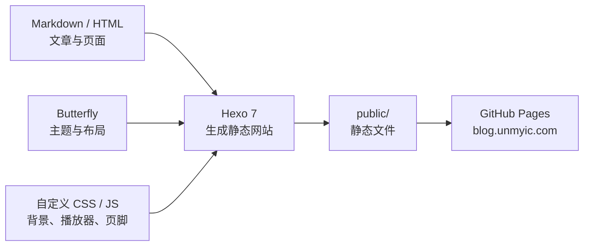
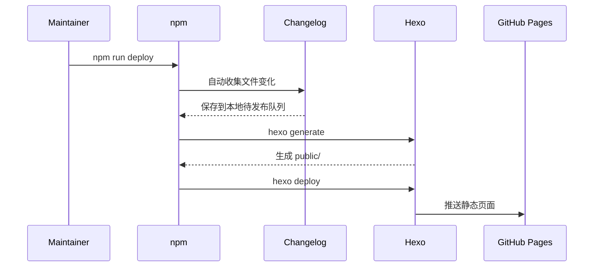

<p align="center">
  
</p>

<h1 align="center">✦ unmyic Blog ✦</h1>

<p align="center">
  <em>向阳花木易逢春 · 以有涯随无涯</em>
</p>

<p align="center">
  <a href="https://blog.unmyic.com">
    
  </a>
  
  
  
</p>

<p align="center">
  <a href="https://blog.unmyic.com">访问博客</a>
  ·
  <a href="https://blog.unmyic.com/archives/">文章归档</a>
  ·
  <a href="https://blog.unmyic.com/categories/">内容分类</a>
  ·
  <a href="https://blog.unmyic.com/log/">更新日志</a>
</p>

---

## 🌌 关于这个博客

这是 **unmyic** 的个人知识与创作空间。

博客用于记录个人的一些学习成果以及一路上值得保存的思考。它以 [Hexo](https://hexo.io/) 为静态站点框架，在 [Butterfly](https://butterfly.js.org/) 主题之上进行了较多视觉与功能定制。

这里不只是文章的陈列柜，也是一个持续生长的个人实验场：

> 写下已经理解的，整理仍在探索的，也为以后回望时留下清晰的坐标。

## ✨ 网站特色

| 模块 | 说明 |
| --- | --- |
| 🌊 沉浸式背景 | 为亮色与暗色主题分别设计 2K 海景背景，并加入连续滚动淡化和氛围动画 |
| 📱 移动端适配 | 使用独立的 9:16 日间、夜间背景，优化竖屏构图和导航显示 |
| 🎵 自制音乐播放器 | 接入网易云歌单，支持歌单、音量、静音、进度、随机播放和循环模式 |
| 🌗 昼夜主题 | 背景、Logo、文字和播放器会随亮色/暗色主题协同变化 |
| ∑ 数学公式 | 使用 KaTeX 渲染 LaTeX，并同步处理文章目录中的公式 |
| 📚 系列文章 | 将有限元方法问答拆分为独立章节，同时保留统一的合集入口 |
| 📄 资料阅读 | 支持 PDF 在线查看与下载，方便分享完整学习资料 |
| 🧭 阅读体验 | 包含本地搜索、文章目录、字数统计、过期提醒和简介悬浮详情 |
| 📝 更新日志 | 自动检测文章、组件、主题和资源变化，在本地累计后批量发布 |

## 🖼️ 视觉预览

<table>
  <tr>
    <td align="center" width="50%">
      
      <br>
      <sub><b>Daylight · 向海而生</b></sub>
    </td>
    <td align="center" width="50%">
      
      <br>
      <sub><b>Starlight · 与星同行</b></sub>
    </td>
  </tr>
</table>

<details>
  <summary><b>📱 查看移动端背景设计</b></summary>
  <br>
  <table>
    <tr>
      <td align="center">
        
        <br>
        <sub>移动端 · 日间</sub>
      </td>
      <td align="center">
        
        <br>
        <sub>移动端 · 夜间</sub>
      </td>
    </tr>
  </table>
</details>

## 🧩 技术栈

<p>
  
  
  
  
  
  
  
  
</p>



## 🚀 本地运行

### 1. 准备环境

请先安装：

- [Node.js](https://nodejs.org/)
- npm（通常随 Node.js 一同安装）
- Git（部署或版本管理时使用）

### 2. 安装依赖

获取项目源码并进入项目目录后执行：

```bash
npm install
```

### 3. 启动本地预览

```bash
npm run server
```

浏览器访问：

```text
http://localhost:4000/
```

### 4. 生成静态页面

```bash
npm run build
```

生成结果位于 `public/`。

## 🛠️ 常用命令

| 命令 | 作用 |
| --- | --- |
| `npm run server` | 启动本地预览服务器 |
| `npm run build` | 执行 `hexo generate` |
| `npm run clean` | 清理缓存与 `public/` |
| `npm run deploy` | 收集更新、生成页面并部署 |
| `npm run changelog:collect` | 手动检测并暂存网站变化 |
| `npm run changelog:status` | 查看尚未发布的更新 |
| `npm run changelog:publish` | 将累计内容写入网站日志 |

> 部署时请优先使用 `npm run deploy`，不要直接使用 `hexo d`。前者会先执行更新日志收集，然后生成并部署最新页面。

## ✍️ 新建文章

可以使用 Hexo 命令创建文章：

```bash
npx hexo new post "文章标题"
```

文章位于：

```text
source/_posts/
```

推荐的 Front Matter：

```yaml
---
title: 文章标题
date: 2026-07-26 12:00:00
updated: 2026-07-26 12:00:00
tags:
  - 标签
categories:
  - 分类
description: 用一两句话概括文章内容。
cover: /img/cover.webp
---
```

全站图片建议放在 `source/img/`，可下载附件建议放在 `source/downloads/`。

## 📝 更新日志工作流

项目内置了一个不依赖源码 Git 仓库的更新检测器。它通过文件内容哈希比较两次部署之间的变化，并识别：

- 新增、修改或删除文章；
- 新增、优化或移除 CSS/JavaScript 组件；
- Butterfly 主题与网站配置变化；
- 图片、PDF 等资源更新；
- 构建脚本、依赖和部署设置变化。

检测结果保存在：

```text
.local/changelog/
```

该目录不会进入生成的网站，也已被 `.gitignore` 忽略。

```bash
# 查看累计内容
npm run changelog:status

# 添加一条更准确的人工说明
npm run changelog:add -- "优化音乐播放器移动端交互"

# 将全部累计内容整理到网站日志
npm run changelog:publish

# 使用自定义标题发布
npm run changelog:publish -- --title="七月网站功能更新"
```

默认累计 **20 条更新**或保存满 **30 天**后提示发布，具体设置见 [`changelog.config.json`](./changelog.config.json)。完整说明见 [`CHANGELOG_WORKFLOW.md`](./CHANGELOG_WORKFLOW.md)。

## 🗂️ 项目结构

```text
blog-demo/
├─ source/
│  ├─ _posts/                 # Markdown 文章
│  ├─ css/                    # 自定义样式
│  ├─ js/                     # 自定义交互与组件
│  ├─ img/                    # 图片与背景资源
│  ├─ downloads/              # PDF 等下载附件
│  ├─ log/                    # 网站更新日志页面
│  └─ data/                   # 友链等结构化数据
├─ scripts/                   # Hexo 扩展脚本
├─ tools/
│  └─ changelog.js            # 本地更新日志工具
├─ themes/                    # 本地主题文件
├─ _config.yml                # Hexo 主配置
├─ _config.butterfly.yml      # Butterfly 主题配置
├─ changelog.config.json      # 更新日志规则
└─ package.json               # 依赖与 npm 命令
```

## 🎨 自定义入口

| 想要修改的内容 | 主要位置 |
| --- | --- |
| 网站标题、域名、部署仓库 | `_config.yml` |
| 导航、主题色、背景和侧栏 | `_config.butterfly.yml` |
| 日间与夜间背景 | `source/img/banner-ocean-*.webp` |
| 背景滚动与氛围效果 | `source/css/hero-scroll.css`、`source/js/hero-scroll.js` |
| 音乐播放器 | `source/css/music-player.css`、`source/js/music-player.js` |
| 页脚运行时间 | `source/css/runtime.css`、`source/js/runtime.js` |
| 页脚格言 | `source/css/custom-footer.css`、`source/js/custom-footer.js` |
| 网站更新日志 | `source/log/index.md` |

## 🔍 构建与部署流程



## 🤝 交流与反馈

如果你发现文章错误、页面显示问题，或者对博客功能有新的想法，欢迎通过以下方式交流：

- GitHub：[@unmyic](https://github.com/unmyic)
- Email：[unmyic@gmail.com](mailto:unmyic@gmail.com)
- Blog：[blog.unmyic.com](https://blog.unmyic.com)

---

<p align="center">
  
</p>

<p align="center">
  <em>“谁终将声震人间，必长久深自缄默。”</em>
</p>

<p align="center">
  Built with curiosity, patience and a little starlight.
</p>
